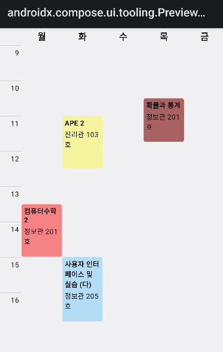
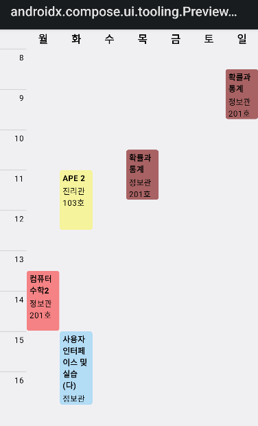

[](https://jitpack.io/#cometj03/ComposeTimeTable)

# ComposeTimeTable

ComposeTimeTable is customizable (not yet) and flexiable timetable based on [Jetpack Compose](https://developer.android.com/jetpack/compose)

## Preview



Column count: 5



Column count: 7

## Download

**Step 1.** Add the JitPack repository to your build file

```gradle
allprojects {
  repositories {
    ...
    maven { url 'https://jitpack.io' }
  }
}
```

**Step 2.** Add the dependency

> Check [here](https://jitpack.io/#cometj03/ComposeTimeTable/) for latest version

```gradle
dependencies {
    implementation "com.github.cometj03:ComposeTimeTable:$latest_timetable_version"
}
```

## Usage
..
